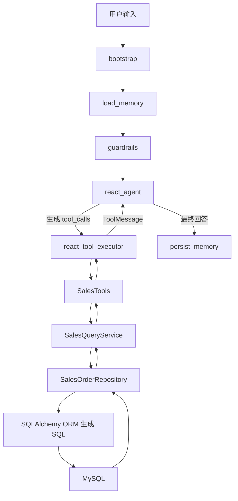
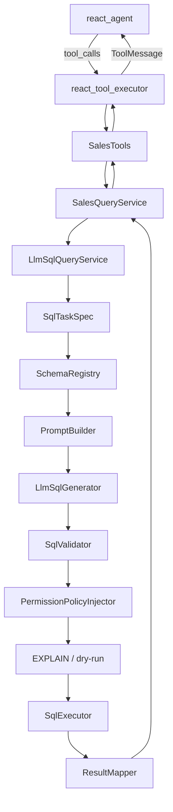

# sales-agent 项目查询工具改造为 LLM 生成 SQL 详细设计

## 1. 文档目的

本文档设计如何把 `sales-agent` 项目中“查询数据库的工具”从当前的确定性 ORM 查询，改造成“由 LLM 生成 SQL、系统校验后执行”的模式。

本次改造的核心目标不是让用户直接写 SQL，也不是让 ReAct Agent 随意访问数据库，而是在现有工具体系内部增加一层受控的 SQL 生成能力：

```text
用户问题 -> ReAct Agent 选择工具 -> 工具整理查询意图 -> SQL LLM 生成只读 SQL
       -> SQL 校验/权限注入/预执行检查 -> 数据库执行 -> 工具格式化结果
       -> ReAct Agent 判断是否继续调用工具或返回最终答案
```

## 2. 当前实现现状

### 2.1 当前调用链路

当前项目中，LLM 只负责在 ReAct 节点里选择工具和组织最终回答，真正查数据库的 SQL 逻辑是确定性写死在服务层和仓储层里的。



### 2.2 关键源码位置

| 层级 | 文件 | 当前职责 |
| --- | --- | --- |
| Agent 图 | `app/graph/builder.py` | 定义 `react_agent <-> react_tool_executor` 循环 |
| ReAct 节点 | `app/graph/nodes/react_agent.py` | 绑定工具，让 LLM 判断是否调用工具 |
| 工具执行节点 | `app/graph/nodes/react_tool_executor.py` | 执行 LLM 发起的 tool call，并把结果返回给 `react_agent` |
| 工具定义 | `app/graph/react_tools.py` | 定义 `query_sales_data`、`get_sales_summary` 等工具名称、描述、参数 |
| 工具实现 | `app/logic/tools.py` | 参数校验、调用服务、格式化文本和图表 |
| 业务服务 | `app/logic/services.py` | 权限过滤、缓存、业务计算 |
| 数据仓储 | `app/db/repositories.py` | 使用 SQLAlchemy ORM 编写确定性查询 |
| ORM 模型 | `app/db/models.py` | 定义 `sa_sales_order`、`sa_sales_rep`、`sa_product` 等表结构 |

### 2.3 当前“SQL”实际在哪里

当前项目没有大量手写 SQL 字符串，查询主要在 `app/db/repositories.py` 中通过 SQLAlchemy 表达式生成。例如：

```python
stmt = select(func.coalesce(func.sum(SalesOrder.amount), 0)).where(
    SalesOrder.status == "COMPLETED",
    SalesOrder.order_date.between(start, end),
)
```

这类代码最终会被 SQLAlchemy 编译成 MySQL SQL 执行。

因此，本次改造的实际含义是：

1. 保留外层 ReAct 工具名和参数。
2. 把 `SalesOrderRepository` 中面向订单、销售额、排名、趋势的固定查询，替换或包裹为 LLM 生成 SQL。
3. 仍由系统负责权限、安全、参数、缓存、结果 DTO 映射，不能完全交给 LLM。

## 3. 改造目标与非目标

### 3.1 改造目标

1. 支持由 LLM 根据工具意图生成 SQL。
2. 保留现有工具协议，前端、接口、ReAct 图节点尽量不变。
3. 支持更灵活的业务查询，例如按品类、大区、销售员、状态、产品、时间组合查询。
4. SQL 执行必须只读、可校验、可审计、可回退。
5. 现有权限模型必须继续生效：
   - `SALES_REP` 只能看自己的数据。
   - `SALES_MANAGER` 只能看自己大区的数据。
   - `SALES_DIRECTOR` 可以看全公司数据。
6. 保留现有 Redis 缓存和指标统计能力。
7. 保留确定性 fallback，LLM SQL 失败时不影响主流程。

### 3.2 非目标

1. 不允许用户直接提交任意 SQL 执行。
2. 不允许 LLM 访问 `sa_chat_memory` 等非销售查询表。
3. 不允许 LLM 生成写操作 SQL。
4. 不把现有 ReAct 架构改成 Plan-Executor。
5. 不让 SQL LLM 直接决定最终答案，最终答案仍由外层 `react_agent` 结合工具结果生成。

## 4. 推荐总体架构

### 4.1 两层 LLM 分工

改造后项目会有两类 LLM 调用：

| LLM 层 | 位置 | 职责 | 是否直接访问数据库 |
| --- | --- | --- | --- |
| ReAct LLM | `react_agent_node` | 理解用户问题，决定调用哪个工具，判断工具结果是否够用 | 否 |
| SQL LLM | 新增 SQL 生成层 | 根据工具意图、参数、受限 schema 生成 SQL JSON | 否，只生成 SQL 文本 |

SQL LLM 不应该直接接收“无限制自然语言问题然后任意生成 SQL”。更安全的方式是：由现有工具先把参数解析成结构化任务，再交给 SQL LLM。

### 4.2 新增 SQL 生成层

建议新增目录：

```text
app/logic/sql_agent/
  __init__.py
  models.py              # SQL 任务、生成结果、校验结果的数据结构
  schema_registry.py     # 可访问表、字段、join 关系、指标口径白名单
  prompts.py             # SQL 生成提示词
  generator.py           # 调用 LLM 生成 SQL JSON
  validator.py           # SQL 安全校验、语法校验、表字段校验
  policy.py              # 用户权限条件注入
  executor.py            # 参数化执行 SQL，返回 mapping rows
  result_mapper.py       # rows -> DTO / 业务结果
  service.py             # 对外统一入口，供 SalesQueryService 调用
```

### 4.3 改造后调用链路



## 5. 数据库 Schema 暴露范围

### 5.1 允许 SQL LLM 使用的表

只允许销售分析相关表：

| 表名 | 别名 | 说明 |
| --- | --- | --- |
| `sa_sales_order` | `o` | 销售订单事实表 |
| `sa_sales_rep` | `s` | 销售员维表 |
| `sa_sales_region` | `r` | 大区维表 |
| `sa_product` | `p` | 产品维表 |

明确禁止：

| 表名/库 | 禁止原因 |
| --- | --- |
| `sa_chat_memory` | 会话记忆，不属于销售查询，可能包含用户对话 |
| `mysql.*`、`information_schema.*`、`performance_schema.*` | 系统表 |
| 任何未在白名单中的表 | 防止越权和幻觉 |

### 5.2 允许字段

`sa_sales_order o`：

```text
id, order_no, rep_id, product_id, region_id, customer_name,
quantity, unit_price, amount, cost, profit, status, order_date, created_at
```

`sa_sales_rep s`：

```text
id, name, region_id, role, email, created_at
```

`sa_sales_region r`：

```text
id, name, parent_region_id, created_at
```

`sa_product p`：

```text
id, sku_code, name, category, unit_price, cost, status, created_at
```

### 5.3 标准关联关系

SQL LLM 必须使用固定 join 关系：

```sql
JOIN sa_sales_rep s ON s.id = o.rep_id
JOIN sa_sales_region r ON r.id = o.region_id
JOIN sa_product p ON p.id = o.product_id
```

如果查询只需要订单金额汇总，可以不 join 维表；如果涉及大区名、销售员名、产品名、品类、SKU，必须 join 对应维表。

## 6. 统一指标口径

LLM 生成 SQL 前必须知道业务口径，否则它可能把退款、取消订单算进销售额。

| 指标 | 固定口径 |
| --- | --- |
| 销售额 | `SUM(o.amount)`，只统计 `o.status = 'COMPLETED'` |
| 订单数 | 默认统计 `COMPLETED` 订单，异常检测退款率除外 |
| 销售数量 | `SUM(o.quantity)`，只统计 `COMPLETED` 订单 |
| 毛利 | `SUM(o.profit)`，只统计 `COMPLETED` 订单 |
| 退款数 | `SUM(CASE WHEN o.status = 'REFUNDED' THEN 1 ELSE 0 END)` |
| 退款率 | 退款订单数 / 总订单数，允许包含 `COMPLETED`、`REFUNDED`、`CANCELLED` |
| 趋势月份 | MySQL 使用 `DATE_FORMAT(o.order_date, '%Y-%m')` |

## 7. SQL 生成任务模型

新增 `app/logic/sql_agent/models.py`，核心数据结构如下：

```python
from __future__ import annotations

from dataclasses import dataclass
from datetime import date
from typing import Any, Literal

from pydantic import BaseModel, Field


QueryScopeRole = Literal["SALES_REP", "SALES_MANAGER", "SALES_DIRECTOR", "ANONYMOUS"]


class QueryScope(BaseModel):
    role: QueryScopeRole
    user_id: str | None = None
    region_id: int | None = None
    rep_id: int | None = None


class SqlTaskSpec(BaseModel):
    tool_name: str
    task_type: str
    start_date: date | None = None
    end_date: date | None = None
    region_id: int | None = None
    region_name: str | None = None
    rep_id: int | None = None
    rep_name: str | None = None
    product_id: int | None = None
    product_name: str | None = None
    category: str | None = None
    top_n: int | None = None
    months: int | None = None
    dimension: str | None = None
    order_by: str | None = None
    limit: int | None = None
    scope: QueryScope
    result_contract: list[str] = Field(default_factory=list)


class GeneratedSql(BaseModel):
    sql: str
    params: dict[str, Any] = Field(default_factory=dict)
    result_columns: list[str] = Field(default_factory=list)
    reason: str = ""
    confidence: float = 0.0


class SqlValidationResult(BaseModel):
    ok: bool
    errors: list[str] = Field(default_factory=list)
    normalized_sql: str | None = None
```

设计重点：

1. `SqlTaskSpec` 来自工具参数，不直接等于用户原始输入。
2. `QueryScope` 来自后端鉴权上下文，不由 LLM 推断。
3. `result_contract` 约束 SQL 必须返回哪些列，方便后续映射。
4. `GeneratedSql.params` 只能使用命名参数，不允许拼接用户输入。

## 8. Prompt 设计

### 8.1 System Prompt

新增 `app/logic/sql_agent/prompts.py`：

```python
SQL_GENERATION_SYSTEM_PROMPT = """
你是 sales-agent 项目的 MySQL SQL 生成器。
你只能生成只读 SELECT SQL，不能生成 INSERT、UPDATE、DELETE、DROP、ALTER、TRUNCATE、CREATE、REPLACE、CALL、LOAD、GRANT、REVOKE。
你只能使用给定 schema 中列出的表、字段和 join 关系。
你必须使用命名参数，例如 :start_date、:end_date、:region_id。
不要把参数值直接拼进 SQL。
除 JSON 外不要输出任何解释、Markdown 或代码块。
"""
```

### 8.2 User Prompt 模板

```python
SQL_GENERATION_USER_PROMPT = """
数据库方言：MySQL 8。

允许访问的表、字段、join 关系：
{schema_context}

业务指标口径：
{metric_context}

当前查询任务：
{task_spec_json}

返回 JSON，格式必须为：
{{
  "sql": "SELECT ...",
  "params": {{"start_date": "YYYY-MM-DD"}},
  "result_columns": ["column_a", "column_b"],
  "reason": "一句话说明选择该 SQL 的原因",
  "confidence": 0.0
}}

硬性要求：
1. SQL 必须是单条 SELECT 或 WITH ... SELECT。
2. 明细查询必须带 LIMIT。
3. 销售额、排名、趋势默认必须过滤 o.status = 'COMPLETED'。
4. 不允许查询 sa_chat_memory。
5. 不允许查询系统库。
6. 不允许使用未给出的字段。
7. 不允许使用 SELECT *。
8. 只返回 JSON。
"""
```

### 8.3 示例：销售额汇总

输入任务：

```json
{
  "tool_name": "get_sales_summary",
  "task_type": "sales_summary",
  "start_date": "2026-05-01",
  "end_date": "2026-05-31",
  "region_name": "华北区",
  "region_id": 3,
  "scope": {
    "role": "SALES_DIRECTOR",
    "user_id": "u001",
    "region_id": null,
    "rep_id": null
  },
  "result_contract": ["total_amount"]
}
```

期望 LLM 返回：

```json
{
  "sql": "SELECT COALESCE(SUM(o.amount), 0) AS total_amount FROM sa_sales_order o WHERE o.status = 'COMPLETED' AND o.order_date BETWEEN :start_date AND :end_date AND o.region_id = :region_id",
  "params": {
    "start_date": "2026-05-01",
    "end_date": "2026-05-31",
    "region_id": 3
  },
  "result_columns": ["total_amount"],
  "reason": "按订单表统计指定大区在时间范围内已完成订单金额。",
  "confidence": 0.93
}
```

## 9. SQL 安全校验设计

LLM 生成 SQL 后不能直接执行，必须经过校验。

### 9.1 推荐依赖

建议新增依赖：

```text
sqlglot==27.0.0
```

用途：

1. 解析 SQL AST。
2. 判断是否只有一条语句。
3. 判断语句类型是否为 `SELECT`。
4. 提取表名、字段名，做白名单校验。
5. 检查是否存在危险语法。

如果第一阶段不想新增依赖，也可以先用正则和 SQLAlchemy `text()` 做基础校验，但不建议长期这样做。LLM SQL 场景里，AST 校验是安全底线。

### 9.2 校验规则

`app/logic/sql_agent/validator.py` 中实现：

| 规则 | 处理方式 |
| --- | --- |
| 只允许单条 SQL | 出现多个 statement 直接拒绝 |
| 只允许 `SELECT` 或 `WITH ... SELECT` | 非 SELECT 直接拒绝 |
| 禁止分号 | 拒绝 |
| 禁止写操作关键词 | 拒绝 |
| 禁止 `SELECT *` | 拒绝 |
| 禁止系统库 | 拒绝 |
| 表名必须在白名单内 | 拒绝 |
| 字段名必须在白名单内 | 拒绝 |
| 明细查询必须有 `LIMIT` | 自动补 limit 或拒绝 |
| 聚合查询必须返回约定列 | 不满足 `result_contract` 则拒绝 |
| 销售额类查询必须有 `o.status = 'COMPLETED'` | 缺失则尝试修复，否则拒绝 |
| 查询必须带时间范围 | 除元数据查询外，缺失则拒绝 |
| 参数必须命名绑定 | 禁止拼接字符串参数 |

### 9.3 危险关键词列表

至少包含：

```text
INSERT, UPDATE, DELETE, DROP, ALTER, TRUNCATE, CREATE, REPLACE,
GRANT, REVOKE, CALL, EXEC, LOAD, OUTFILE, INFILE, INTO OUTFILE,
LOCK, UNLOCK, SET, SHOW, DESCRIBE, EXPLAIN ANALYZE
```

说明：`EXPLAIN` 由系统自己执行，不允许 LLM 生成。

### 9.4 校验伪代码

```python
class SqlValidator:
    def validate(self, generated: GeneratedSql, task: SqlTaskSpec) -> SqlValidationResult:
        sql = generated.sql.strip()

        if ";" in sql:
            return self._fail("SQL 不允许包含分号")

        if self._contains_dangerous_keyword(sql):
            return self._fail("SQL 包含危险关键词")

        ast = sqlglot.parse_one(sql, read="mysql")
        if not self._is_select(ast):
            return self._fail("只允许 SELECT 查询")

        tables = self._extract_tables(ast)
        if not tables <= self.schema.allowed_tables:
            return self._fail("SQL 使用了未授权表")

        columns = self._extract_columns(ast)
        if not self.schema.allows_columns(columns):
            return self._fail("SQL 使用了未授权字段")

        if task.task_type in self.schema.sales_metric_tasks:
            if not self._has_completed_status_filter(ast):
                return self._fail("销售指标查询必须过滤 COMPLETED 状态")

        if task.task_type in self.schema.detail_tasks:
            sql = self._ensure_limit(sql, task.limit or 50)

        return SqlValidationResult(ok=True, normalized_sql=sql)
```

## 10. 权限注入设计

权限不能依赖 LLM 自觉生成，必须由后端强制注入。

### 10.1 当前权限行为

当前 `SalesQueryService` 的权限逻辑：

| 角色 | 当前限制 |
| --- | --- |
| `SALES_REP` | 只能看 `current_user.rep_id` 对应订单 |
| `SALES_MANAGER` | 只能看 `current_user.region_id` 对应大区 |
| `SALES_DIRECTOR` | 可看全公司 |
| 未启用鉴权 | 演示模式，可看全量 |

### 10.2 新权限策略

新增 `app/logic/sql_agent/policy.py`：

```python
class PermissionPolicyInjector:
    def apply(self, sql: str, params: dict, scope: QueryScope) -> tuple[str, dict]:
        if scope.role == "SALES_REP":
            return self._append_order_filter(sql, params, "o.rep_id = :scope_rep_id", {"scope_rep_id": scope.rep_id})

        if scope.role == "SALES_MANAGER":
            return self._append_order_filter(sql, params, "o.region_id = :scope_region_id", {"scope_region_id": scope.region_id})

        return sql, params
```

推荐实现方式：

1. 用 AST 在 `WHERE` 中追加权限条件，而不是简单字符串拼接。
2. 如果 SQL 没有使用 `sa_sales_order o`，但任务又属于销售数据查询，直接拒绝。
3. 如果 SQL 已经有用户请求的大区过滤，也仍然叠加当前用户权限过滤。
4. 如果用户请求超出权限范围，比如销售经理请求其他大区，优先在工具层返回“无权限查询该范围”。

示例：

用户是 `SALES_MANAGER`，`region_id=3`，LLM 生成：

```sql
SELECT COALESCE(SUM(o.amount), 0) AS total_amount
FROM sa_sales_order o
WHERE o.status = 'COMPLETED'
  AND o.order_date BETWEEN :start_date AND :end_date
```

系统注入后：

```sql
SELECT COALESCE(SUM(o.amount), 0) AS total_amount
FROM sa_sales_order o
WHERE o.status = 'COMPLETED'
  AND o.order_date BETWEEN :start_date AND :end_date
  AND o.region_id = :scope_region_id
```

参数增加：

```json
{
  "scope_region_id": 3
}
```

## 11. SQL 执行设计

### 11.1 执行器

新增 `app/logic/sql_agent/executor.py`：

```python
from sqlalchemy import text
from sqlalchemy.orm import Session


class SqlExecutor:
    def __init__(self, db: Session, max_rows: int = 200) -> None:
        self.db = db
        self.max_rows = max_rows

    def explain(self, sql: str, params: dict) -> None:
        self.db.execute(text(f"EXPLAIN {sql}"), params).all()

    def execute(self, sql: str, params: dict) -> list[dict]:
        rows = self.db.execute(text(sql), params).mappings().all()
        return [dict(row) for row in rows[: self.max_rows]]
```

### 11.2 数据库账号要求

生产环境应使用只读账号执行 LLM SQL：

```sql
CREATE USER 'sales_agent_readonly'@'%' IDENTIFIED BY '***';
GRANT SELECT ON jc_sales_agent_py.sa_sales_order TO 'sales_agent_readonly'@'%';
GRANT SELECT ON jc_sales_agent_py.sa_sales_rep TO 'sales_agent_readonly'@'%';
GRANT SELECT ON jc_sales_agent_py.sa_sales_region TO 'sales_agent_readonly'@'%';
GRANT SELECT ON jc_sales_agent_py.sa_product TO 'sales_agent_readonly'@'%';
```

即使应用层校验失误，数据库账号也不应具备写权限。

### 11.3 超时与行数限制

建议增加：

1. 查询超时：3 到 5 秒。
2. 明细查询默认 `LIMIT 20`，最大 `LIMIT 50`。
3. 聚合查询最大返回 200 行。
4. 禁止笛卡尔积查询。
5. 对 `order_date`、`region_id`、`rep_id`、`product_id` 建索引。

## 12. 对现有工具的具体改造

### 12.1 保持 `react_tools.py` 不变

`app/graph/react_tools.py` 中工具名、描述、参数模型建议保持不变：

| 工具名 | 是否改工具协议 | 原因 |
| --- | --- | --- |
| `query_sales_data` | 否 | 前端和 ReAct prompt 已经依赖 |
| `get_sales_summary` | 否 | 参数足够生成 SQL |
| `get_top_reps` | 否 | 参数足够生成 SQL |
| `get_region_ranking` | 否 | 参数足够生成 SQL |
| `get_top_products` | 否 | 参数足够生成 SQL |
| `calc_month_over_month` | 否 | 由服务层拆成两个 SQL 任务 |
| `calc_year_over_year` | 否 | 由服务层拆成两个 SQL 任务 |
| `get_monthly_trend` | 否 | 参数足够生成 SQL |
| `generate_line_chart` | 否 | 底层复用趋势查询 |
| `generate_bar_chart` | 否 | 底层复用排名查询 |
| `generate_pie_chart` | 否 | 底层复用排名查询 |
| `detect_sales_anomalies` | 暂不建议第一阶段改 | 异常规则更适合先保留确定性业务逻辑 |

### 12.2 `query_sales_data`

当前行为：

```text
按日期范围、大区、销售员查询订单明细，返回订单号、日期、销售员、客户、金额、状态。
```

SQL LLM 任务：

```text
task_type = order_detail
result_contract = [
  "order_no", "order_date", "rep_name", "region_name",
  "product_name", "customer_name", "amount", "status"
]
```

推荐 SQL：

```sql
SELECT
  o.order_no,
  o.order_date,
  s.name AS rep_name,
  r.name AS region_name,
  p.name AS product_name,
  o.customer_name,
  o.amount,
  o.status
FROM sa_sales_order o
JOIN sa_sales_rep s ON s.id = o.rep_id
JOIN sa_sales_region r ON r.id = o.region_id
JOIN sa_product p ON p.id = o.product_id
WHERE o.order_date BETWEEN :start_date AND :end_date
  AND (:region_id IS NULL OR o.region_id = :region_id)
  AND (:rep_id IS NULL OR o.rep_id = :rep_id)
ORDER BY o.order_date DESC, o.id DESC
LIMIT :limit
```

注意：

1. 订单明细可以展示 `REFUNDED`、`CANCELLED`，所以这里不强制 `COMPLETED`。
2. 金额小计仍由工具层只统计 `COMPLETED`。
3. `limit` 必须由系统限制到 50 以内。

### 12.3 `get_sales_summary`

任务：

```text
task_type = sales_summary
result_contract = ["total_amount"]
```

SQL 口径：

```sql
SELECT COALESCE(SUM(o.amount), 0) AS total_amount
FROM sa_sales_order o
WHERE o.status = 'COMPLETED'
  AND o.order_date BETWEEN :start_date AND :end_date
  AND (:region_id IS NULL OR o.region_id = :region_id)
```

结果映射：

```python
total = Decimal(str(rows[0]["total_amount"] or 0))
```

### 12.4 `get_top_reps`

任务：

```text
task_type = rep_ranking
result_contract = ["rep_id", "rep_name", "region_id", "region_name", "total_amount"]
```

推荐 SQL：

```sql
SELECT
  s.id AS rep_id,
  s.name AS rep_name,
  r.id AS region_id,
  r.name AS region_name,
  COALESCE(SUM(o.amount), 0) AS total_amount
FROM sa_sales_order o
JOIN sa_sales_rep s ON s.id = o.rep_id
JOIN sa_sales_region r ON r.id = o.region_id
WHERE o.status = 'COMPLETED'
  AND o.order_date BETWEEN :start_date AND :end_date
GROUP BY s.id, s.name, r.id, r.name
ORDER BY total_amount DESC
LIMIT :top_n
```

如果指定大区，在权限注入前先加业务过滤：

```sql
AND o.region_id = :region_id
```

### 12.5 `get_region_ranking`

任务：

```text
task_type = region_ranking
result_contract = ["region_id", "region_name", "total_amount"]
```

推荐 SQL：

```sql
SELECT
  r.id AS region_id,
  r.name AS region_name,
  COALESCE(SUM(o.amount), 0) AS total_amount
FROM sa_sales_order o
JOIN sa_sales_region r ON r.id = o.region_id
WHERE o.status = 'COMPLETED'
  AND o.order_date BETWEEN :start_date AND :end_date
GROUP BY r.id, r.name
ORDER BY total_amount DESC
```

权限影响：

1. `SALES_MANAGER` 注入 `o.region_id = :scope_region_id` 后只能返回一个大区。
2. `SALES_REP` 当前项目对区域排名返回空列表，建议保持这个语义：在服务层直接返回空，不调用 SQL LLM。

### 12.6 `get_top_products`

任务：

```text
task_type = product_ranking
result_contract = [
  "product_id", "sku_code", "product_name", "category",
  "total_amount", "total_quantity"
]
```

推荐 SQL：

```sql
SELECT
  p.id AS product_id,
  p.sku_code,
  p.name AS product_name,
  p.category,
  COALESCE(SUM(o.amount), 0) AS total_amount,
  COALESCE(SUM(o.quantity), 0) AS total_quantity
FROM sa_sales_order o
JOIN sa_product p ON p.id = o.product_id
WHERE o.status = 'COMPLETED'
  AND o.order_date BETWEEN :start_date AND :end_date
  AND (:region_id IS NULL OR o.region_id = :region_id)
GROUP BY p.id, p.sku_code, p.name, p.category
ORDER BY total_amount DESC
LIMIT :top_n
```

如果 `top_n` 为负数，当前工具表示“最差产品”。建议不要让 SQL LLM 理解负数语义，而是在工具层转换：

```text
top_n < 0 -> task.order_by = "total_amount_asc"
```

然后要求 SQL：

```sql
ORDER BY total_amount ASC
```

### 12.7 `calc_month_over_month`

当前工具做两次 `query_total_amount`：

1. 当前周期销售额。
2. 上一周期销售额。
3. 服务层计算增长率。

改造后仍建议保持这个拆法：

```text
calc_month_over_month
  -> build sales_summary task for current period
  -> build sales_summary task for previous period
  -> deterministic calc_growth_rate
```

不要让 LLM 直接计算环比百分比。金额查询可以由 SQL LLM 生成，但增长率计算应由 Python 保持确定性。

### 12.8 `calc_year_over_year`

同同比：

```text
calc_year_over_year
  -> 当前日期范围 sales_summary
  -> 去年同期 sales_summary
  -> Python 计算同比
```

年份替换逻辑继续放在 `SalesTools.calc_year_over_year` 或 `SalesQueryService`。

### 12.9 `get_monthly_trend`

任务：

```text
task_type = monthly_trend
result_contract = ["month", "total_amount", "order_count"]
```

推荐 SQL：

```sql
SELECT
  DATE_FORMAT(o.order_date, '%Y-%m') AS month,
  COALESCE(SUM(o.amount), 0) AS total_amount,
  COUNT(o.id) AS order_count
FROM sa_sales_order o
WHERE o.status = 'COMPLETED'
  AND o.order_date BETWEEN :start_date AND :end_date
  AND (:region_id IS NULL OR o.region_id = :region_id)
GROUP BY DATE_FORMAT(o.order_date, '%Y-%m')
ORDER BY month ASC
```

`months -> start_date/end_date` 仍由 Python 计算，避免 LLM 对“近 N 个月”的日期理解不稳定。

### 12.10 图表工具

图表工具不直接生成 SQL，而是继续复用底层查询服务：

| 图表工具 | 底层数据 |
| --- | --- |
| `generate_line_chart` | `query_monthly_trend` |
| `generate_bar_chart(dimension=region)` | `query_region_ranking` |
| `generate_bar_chart(dimension=rep)` | `query_rep_ranking` |
| `generate_bar_chart(dimension=product)` | `query_product_ranking` |
| `generate_bar_chart(dimension=category)` | `query_product_ranking` 后 Python 聚合品类 |
| `generate_pie_chart` | 同柱状图数据来源 |

ECharts option 继续由 Python 确定性生成，不交给 LLM。

### 12.11 异常检测工具

第一阶段不建议把 `detect_sales_anomalies` 完全改成 LLM SQL。

原因：

1. 异常检测是业务规则，不只是查询。
2. 当前规则包括大区骤降、连续零销售、退款率异常、销售员业绩骤降。
3. 阈值来自配置，不适合由 LLM 自行决定。

推荐第一阶段：

1. 保留异常判断逻辑在 Python。
2. 异常规则内部需要的数据查询，可以逐步改为 SQL LLM 生成。
3. 每条异常规则都给固定 `task_type`，不能让 LLM 自由定义异常。

## 13. `SalesQueryService` 改造方案

### 13.1 初始化

当前：

```python
self.order_repo = SalesOrderRepository(db)
```

改造后：

```python
self.order_repo = SalesOrderRepository(db)
self.llm_sql = LlmSqlQueryService(
    db=db,
    current_user=current_user,
    redis_client=redis_client,
    settings=get_settings(),
    fallback_repo=self.order_repo,
)
```

### 13.2 查询方法改造策略

建议不要一次删除 `SalesOrderRepository` 的旧方法，而是分阶段让服务层选择：

```python
def query_total_amount(self, region_id: int | None, start: date, end: date) -> Decimal:
    if self.settings.llm_sql_enabled:
        return self.llm_sql.query_total_amount(region_id, start, end)
    return self._query_total_amount_deterministic(region_id, start, end)
```

这样可以：

1. 支持灰度发布。
2. 支持测试对比。
3. LLM SQL 失败时可回退。
4. 不影响现有业务演示。

## 14. 配置项设计

在 `app/core/config.py` 增加：

```python
llm_sql_enabled: bool = Field(default=False, alias="LLM_SQL_ENABLED", description="是否启用 LLM 生成 SQL")
llm_sql_shadow_mode: bool = Field(default=True, alias="LLM_SQL_SHADOW_MODE", description="是否只生成 SQL 并与确定性结果对比，不实际使用")
llm_sql_model: str = Field(default="", alias="LLM_SQL_MODEL", description="SQL 生成使用的模型，留空时复用 OPENAI_MODEL")
llm_sql_temperature: float = Field(default=0.0, alias="LLM_SQL_TEMPERATURE", description="SQL 生成温度")
llm_sql_repair_attempts: int = Field(default=1, alias="LLM_SQL_REPAIR_ATTEMPTS", description="SQL 生成失败后的修复次数")
llm_sql_max_rows: int = Field(default=200, alias="LLM_SQL_MAX_ROWS", description="LLM SQL 最大返回行数")
llm_sql_timeout_seconds: int = Field(default=5, alias="LLM_SQL_TIMEOUT_SECONDS", description="SQL 执行超时时间")
llm_sql_use_fallback: bool = Field(default=True, alias="LLM_SQL_USE_FALLBACK", description="LLM SQL 失败时是否回退确定性查询")
```

`.env.example` 增加：

```text
LLM_SQL_ENABLED=false
LLM_SQL_SHADOW_MODE=true
LLM_SQL_MODEL=
LLM_SQL_TEMPERATURE=0
LLM_SQL_REPAIR_ATTEMPTS=1
LLM_SQL_MAX_ROWS=200
LLM_SQL_TIMEOUT_SECONDS=5
LLM_SQL_USE_FALLBACK=true
```

## 15. 缓存设计

当前 Redis 缓存 key 主要按查询类型、日期、大区等组成。LLM SQL 改造后，缓存 key 需要额外包含 SQL 生成版本和用户权限范围。

推荐 key：

```text
llm-sql:{schema_version}:{tool_name}:{task_hash}:{scope_hash}:{sql_hash}
```

其中：

| 字段 | 说明 |
| --- | --- |
| `schema_version` | schema registry 版本，表结构或口径变化时递增 |
| `tool_name` | 工具名 |
| `task_hash` | 结构化任务参数 hash |
| `scope_hash` | 用户权限范围 hash |
| `sql_hash` | 规范化 SQL hash |

TTL：

| 查询类型 | 建议 TTL |
| --- | --- |
| 销售额汇总 | 300 秒 |
| 排名 | 300 秒 |
| 趋势 | 300 秒 |
| 明细订单 | 60 秒 |
| 异常检测 | 300 秒 |

## 16. 日志与可观测性

### 16.1 需要记录的日志

每次 SQL LLM 查询记录：

```json
{
  "request_id": "xxx",
  "tool_name": "get_sales_summary",
  "task_type": "sales_summary",
  "sql_hash": "abc123",
  "validation_ok": true,
  "repair_count": 0,
  "row_count": 1,
  "llm_duration_ms": 412,
  "sql_duration_ms": 18,
  "fallback_used": false
}
```

注意：

1. 不记录数据库密码。
2. 不记录 OpenAI API Key。
3. 生产环境可记录 SQL 模板，但不要记录包含敏感客户名的参数。
4. 如需排查，可在开发环境打开详细 SQL 日志。

### 16.2 指标

建议在 `app/core/metrics.py` 增加：

| 指标 | 说明 |
| --- | --- |
| `llm_sql_generation_count` | SQL 生成次数 |
| `llm_sql_validation_failed_count` | SQL 校验失败次数 |
| `llm_sql_repair_count` | SQL 修复次数 |
| `llm_sql_execution_failed_count` | SQL 执行失败次数 |
| `llm_sql_fallback_count` | 回退确定性查询次数 |
| `llm_sql_avg_generation_ms` | SQL 生成平均耗时 |
| `llm_sql_avg_execution_ms` | SQL 执行平均耗时 |

## 17. 错误处理与回退

### 17.1 失败类型

| 失败点 | 处理 |
| --- | --- |
| LLM 调用失败 | 使用确定性查询 fallback |
| LLM 返回非 JSON | 进行一次 repair，仍失败则 fallback |
| SQL 解析失败 | repair，仍失败则 fallback |
| SQL 校验失败 | repair，仍失败则 fallback |
| 权限注入失败 | 不执行 SQL，直接 fallback 或返回无权限 |
| EXPLAIN 失败 | repair，仍失败则 fallback |
| SQL 执行失败 | fallback |
| 结果列不符合 contract | fallback |

### 17.2 修复 Prompt

当校验失败时，向 SQL LLM 发送：

```text
上一次 SQL 校验失败，错误如下：
{validation_errors}

请在不改变查询任务的前提下，重新生成符合规则的 JSON。
只返回 JSON。
```

修复次数建议最多 1 次，避免内部循环拖慢接口。

### 17.3 fallback 原则

只要 `LLM_SQL_USE_FALLBACK=true`，失败后使用当前 `SalesOrderRepository` 的确定性查询。

这样即使 LLM SQL 生成不稳定，用户仍能拿到结果。

## 18. 灰度迁移方案

### 阶段 0：保留现状

1. 新增 SQL 生成层代码。
2. 不启用。
3. 单元测试先覆盖校验器和 prompt 输出解析。

配置：

```text
LLM_SQL_ENABLED=false
LLM_SQL_SHADOW_MODE=true
```

### 阶段 1：影子模式

行为：

1. 正式结果仍来自确定性查询。
2. 后台额外生成 SQL。
3. 执行 LLM SQL 并与确定性结果对比。
4. 记录差异，不影响用户结果。

适合工具：

1. `get_sales_summary`
2. `get_region_ranking`
3. `get_top_products`
4. `get_monthly_trend`

### 阶段 2：低风险聚合查询启用

先启用：

1. `get_sales_summary`
2. `get_region_ranking`
3. `get_top_products`

原因：这些查询返回结构简单，容易校验。

### 阶段 3：明细查询启用

启用：

1. `query_sales_data`

额外要求：

1. 必须有 `LIMIT`。
2. 客户名字段只在有权限时展示。
3. 单次最大 50 条。

### 阶段 4：同比、环比、图表启用

启用：

1. `calc_month_over_month`
2. `calc_year_over_year`
3. `generate_line_chart`
4. `generate_bar_chart`
5. `generate_pie_chart`

注意：图表只是复用底层查询，不让 LLM 生成图表配置。

### 阶段 5：异常检测局部启用

只把异常检测所需的数据查询改成 SQL LLM，异常规则继续 Python 固定。

## 19. 测试方案

### 19.1 单元测试

新增：

```text
tests/test_llm_sql_validator.py
tests/test_llm_sql_policy.py
tests/test_llm_sql_result_mapper.py
tests/test_llm_sql_service.py
```

覆盖：

1. 拒绝 `DROP TABLE`。
2. 拒绝 `UPDATE`。
3. 拒绝 `SELECT *`。
4. 拒绝 `sa_chat_memory`。
5. 拒绝系统库。
6. 拒绝无时间范围的销售查询。
7. 自动给明细查询限制 `LIMIT`。
8. `SALES_REP` 注入 `o.rep_id`。
9. `SALES_MANAGER` 注入 `o.region_id`。
10. `SALES_DIRECTOR` 不注入额外过滤。

### 19.2 Golden SQL 测试

为每个工具准备固定任务和期望 SQL 结构：

| 工具 | 校验重点 |
| --- | --- |
| `get_sales_summary` | `SUM(o.amount)`、`COMPLETED`、日期范围 |
| `get_top_reps` | join 销售员、大区、group by rep |
| `get_region_ranking` | group by region |
| `get_top_products` | join 产品、sum amount、sum quantity |
| `get_monthly_trend` | `DATE_FORMAT`、按月排序 |
| `query_sales_data` | 明细字段、日期倒序、limit |

### 19.3 差异测试

影子模式下，对比：

1. 当前确定性查询结果。
2. LLM SQL 查询结果。

允许的差异：

| 类型 | 容忍度 |
| --- | --- |
| Decimal 金额 | 精确到分，或格式化后相等 |
| 排名顺序 | 销售额相同时允许同额排序差异 |
| 明细查询 | 同一排序规则下必须一致 |
| 趋势月份 | 必须一致 |

### 19.4 端到端测试问题

建议测试问题：

```text
统计本月全公司销售额，并列出各大区排名和 TOP5 产品。
```

预期 ReAct 过程：

1. `react_agent` 调用 `get_sales_summary`。
2. `react_tool_executor` 执行工具，工具内部生成 SQL 查询总销售额。
3. 回到 `react_agent`。
4. `react_agent` 发现还需要大区排名，调用 `get_region_ranking`。
5. 工具内部生成 SQL 查询大区排名。
6. 回到 `react_agent`。
7. `react_agent` 调用 `get_top_products`。
8. 工具内部生成 SQL 查询产品排名。
9. 回到 `react_agent`。
10. `react_agent` 汇总三个工具结果，输出最终答案。

## 20. 代码落地步骤

### 20.1 第一步：新增 SQL Agent 基础模块

新增：

```text
app/logic/sql_agent/
```

先实现：

1. `models.py`
2. `schema_registry.py`
3. `prompts.py`
4. `validator.py`

这一阶段不调用 LLM，只测试校验能力。

### 20.2 第二步：接入 LLM 生成器

新增：

```text
app/logic/sql_agent/generator.py
```

复用现有 `app/graph/helpers.py` 中的 `build_chat_model` 思路，或抽一个通用 LLM client。

注意 SQL 生成温度必须为 `0`。

### 20.3 第三步：接入执行器和结果映射

新增：

```text
app/logic/sql_agent/executor.py
app/logic/sql_agent/result_mapper.py
app/logic/sql_agent/service.py
```

先支持：

1. `query_total_amount`
2. `query_region_ranking`
3. `query_product_ranking`

### 20.4 第四步：修改 `SalesQueryService`

在 `app/logic/services.py` 中增加开关分支：

```python
if self.settings.llm_sql_enabled:
    return self.llm_sql.query_total_amount(region_id, start, end)
```

保留原始查询方法作为 fallback。

### 20.5 第五步：影子模式对比

当 `LLM_SQL_SHADOW_MODE=true`：

1. 用户结果仍使用确定性查询。
2. 后台执行 LLM SQL。
3. 记录差异。

示例：

```python
deterministic = self.order_repo.sum_amount_all(start, end)
shadow = self.llm_sql.query_total_amount(region_id, start, end)
runtime_metrics.record_llm_sql_diff("query_total_amount", deterministic, shadow)
return deterministic
```

### 20.6 第六步：扩大工具覆盖范围

按风险从低到高：

```text
get_sales_summary
get_region_ranking
get_top_products
get_top_reps
get_monthly_trend
query_sales_data
calc_month_over_month / calc_year_over_year
generate_*_chart
detect_sales_anomalies 内部查询
```

## 21. 关键风险与解决方案

| 风险 | 说明 | 解决方案 |
| --- | --- | --- |
| LLM 幻觉字段 | 生成不存在的列 | schema 白名单 + AST 校验 |
| LLM 漏掉 `COMPLETED` | 销售额口径错误 | 任务级校验，缺失直接修复或拒绝 |
| 越权查询 | 销售员看到全公司 | 后端 AST 权限注入 + 只读账号 |
| SQL 注入 | 参数被拼进 SQL | 命名参数绑定，禁止直接拼值 |
| 查询过慢 | LLM 生成低效 SQL | EXPLAIN、超时、索引、限制 join 和 limit |
| 多语句攻击 | 一次执行多个 SQL | 禁止分号，AST 单语句校验 |
| 结果格式不稳定 | 工具无法格式化 | `result_contract` 强制列名 |
| LLM 不稳定 | 返回非 JSON 或坏 SQL | repair 一次 + fallback |
| 业务口径漂移 | 同一问题结果不同 | Golden SQL + 影子模式差异对比 |

## 22. 推荐索引

为了让 LLM SQL 查询稳定，建议确认这些索引存在：

```sql
CREATE INDEX idx_order_date_status ON sa_sales_order(order_date, status);
CREATE INDEX idx_order_region_date ON sa_sales_order(region_id, order_date);
CREATE INDEX idx_order_rep_date ON sa_sales_order(rep_id, order_date);
CREATE INDEX idx_order_product_date ON sa_sales_order(product_id, order_date);
CREATE INDEX idx_product_category ON sa_product(category);
CREATE INDEX idx_rep_region ON sa_sales_rep(region_id);
```

如果已有索引，不要重复创建。

## 23. 与 ReAct 架构的关系

本次改造不改变 ReAct 架构。

改造前：

```text
react_agent 决定调用 get_sales_summary
tool_executor 执行 get_sales_summary
get_sales_summary 调用固定 ORM 查询
tool_executor 把结果返回 react_agent
react_agent 判断是否继续调用工具或最终回答
```

改造后：

```text
react_agent 决定调用 get_sales_summary
tool_executor 执行 get_sales_summary
get_sales_summary 构造 SqlTaskSpec
SQL LLM 生成 SQL
系统校验、注入权限、执行 SQL
get_sales_summary 格式化结果
tool_executor 把结果返回 react_agent
react_agent 判断是否继续调用工具或最终回答
```

也就是说：

1. `react_tool_executor` 执行完工具后，仍然返回 `react_agent`。
2. `react_agent` 仍然判断工具结果是否可用、是否还要继续调用工具。
3. SQL LLM 只是工具内部的“查询生成器”，不是新的顶层 Agent。

## 24. 示例完整流程

用户问题：

```text
统计本月山西玖森百立科技服务有限公司相关业务的销售额，按大区排名，并列出 TOP5 产品。
```

### 第 1 轮：ReAct LLM

`react_agent` 识别需要多个数据：

1. 销售额汇总。
2. 大区排名。
3. 产品排名。

可能先调用：

```json
{
  "name": "get_sales_summary",
  "args": {
    "start_date": "2026-05-01",
    "end_date": "2026-05-31"
  }
}
```

### 第 1 次工具执行：销售额汇总

`SalesTools.get_sales_summary` 构造：

```json
{
  "tool_name": "get_sales_summary",
  "task_type": "sales_summary",
  "start_date": "2026-05-01",
  "end_date": "2026-05-31",
  "result_contract": ["total_amount"]
}
```

SQL LLM 返回 SQL，系统校验后执行，工具返回：

```text
销售额汇总（2026-05-01 至 2026-05-31，全公司）：
总销售额：¥648,720
```

### 第 2 轮：ReAct LLM

`react_agent` 看到只有汇总，不够回答“大区排名”和“TOP5 产品”，继续调用：

```json
{
  "name": "get_region_ranking",
  "args": {
    "start_date": "2026-05-01",
    "end_date": "2026-05-31"
  }
}
```

### 第 2 次工具执行：大区排名

工具构造 `region_ranking` 任务，SQL LLM 生成按大区 group by 的 SQL。

工具返回：

```text
大区业绩排名（2026-05-01 至 2026-05-31）：

第 1 名：华东区  销售额：¥262,833  占比：40.5%
第 2 名：华南区  销售额：¥182,789  占比：28.2%
第 3 名：华北区  销售额：¥152,363  占比：23.5%
第 4 名：西南区  销售额：¥50,735  占比：7.8%

全公司合计：¥648,720
```

### 第 3 轮：ReAct LLM

继续调用产品排名：

```json
{
  "name": "get_top_products",
  "args": {
    "start_date": "2026-05-01",
    "end_date": "2026-05-31",
    "top_n": 5
  }
}
```

### 第 3 次工具执行：产品排名

工具构造 `product_ranking` 任务，SQL LLM 生成产品维度 SQL。

工具返回 TOP5 产品文本。

### 第 4 轮：ReAct LLM

`react_agent` 已经拥有：

1. 销售额汇总。
2. 大区排名。
3. 产品 TOP5。

因此不再调用工具，输出最终综合回答。

## 25. 最终建议

本项目适合采用“工具协议不变、工具内部 SQL LLM 化”的方案。

推荐最小安全落地路径：

1. 先新增 `app/logic/sql_agent`。
2. 先做 `get_sales_summary`、`get_region_ranking`、`get_top_products` 三个聚合查询。
3. 先跑影子模式，对比旧查询和 LLM SQL 查询结果。
4. 校验稳定后再打开 `LLM_SQL_ENABLED=true`。
5. 最后再扩展到明细、趋势、图表和异常检测内部查询。

最重要的设计原则是：

```text
LLM 只负责生成候选 SQL；
系统负责 schema 约束、权限注入、安全校验、执行控制、结果映射和失败回退。
```
